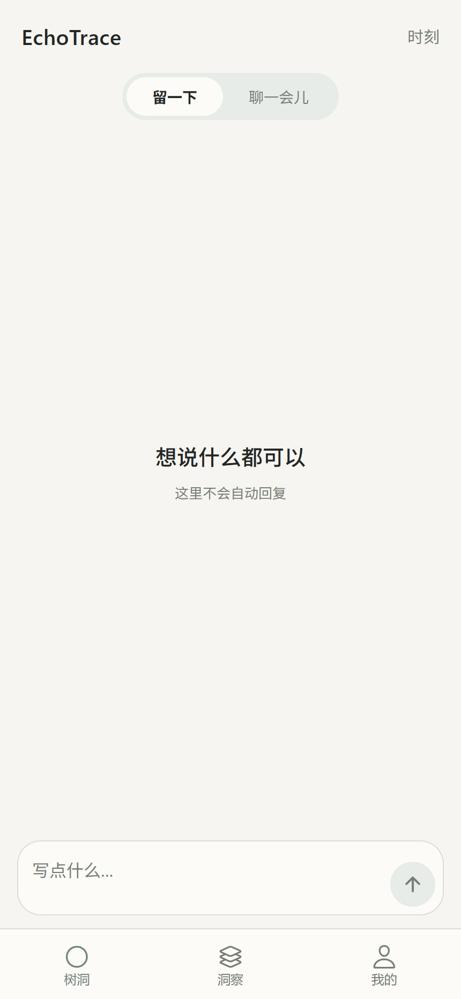
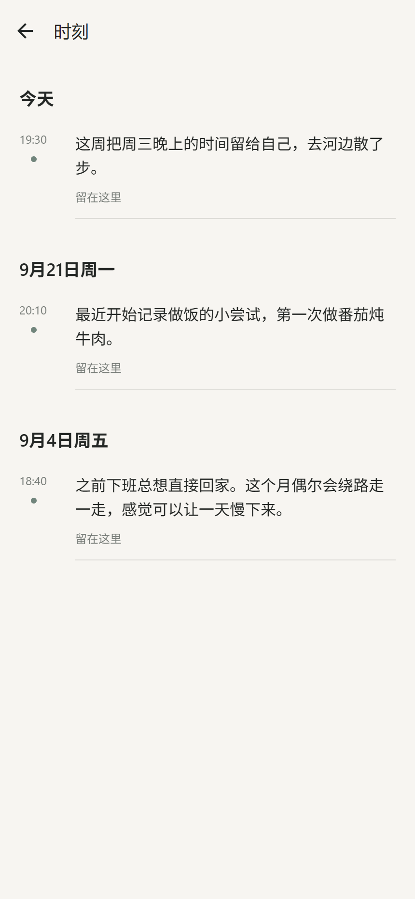

# EchoTrace · 给生活留一条线索

EchoTrace 是一款有长期记忆的个人树洞。你可以随手留下一段话，也可以和 AI 聊一会儿；当记录慢慢积累，它会帮你回看这一周，并从真实的过去里寻找值得注意的变化。每条关于「你」的发现都应该能回到原始记录，而不是由 AI 凭空猜测。

当前 V1 聚焦文字记录与对话。语音、图片和文件输入尚未加入。

## 看看产品

<p align="center">
  
  
  
</p>
<p align="center">
  
  
</p>

界面来自当前 Expo 应用的 Web 预览；截图中的记录与发现是虚构演示内容，不是真实用户数据或模型评测结果。

## 一段记录，之后还能被理解

1. **留一下**：写下当下的想法，无须等待 AI 回答。原文作为 Moment 保存，随时可以在「时刻」里找回。
2. **聊一会儿**：需要有人陪你梳理时，可以开启连续对话。Companion 会理解当前对话；只有需要时才检索相关历史。
3. **回看这一周**：有新记录的周可以形成简短回顾；没有新内容就不生成空洞的总结。过往回顾会保留，方便以后再看。
4. **发现与追问**：「AI 发现」尝试找出跨时间的变化；「我想知道」让你主动提问。重要的个人结论附有来源，可以点回原始 Moment 核对。

EchoTrace 的设计目标是不以一条情绪记录定义一个人。原始记录持续保存，周期回顾用于帮助定位线索；生成长期洞察时，系统检查时间顺序、相反证据与结论是否有据，但仍可能出现过度推断或时间理解错误。它是回顾生活的工具，不提供心理诊断。

## 当前版本

- **本地质量版**：文字输入、Moment 与 Thread、Companion、长期记忆检索、每周回顾、AI 发现、主动提问和证据回溯已接入。深度洞察使用多角色分析与证据核验，生成需要一定时间；打开「AI 发现」时会检查已结束的周并在本地后台整理，已有内容仍可查看。目前不是独立定时任务，进程停止可能中断生成。
- **[在线预览](https://echotrace-web.vercel.app/)**：较早部署的 Demo，便于浏览界面；它尚未同步本地质量版的全部更新。当前产品与 AI 效果以本地版本为准。
- **后续方向**：语音转写、图片与文件输入，以及更适合持续使用的 Android 安装体验。

## 技术实现

客户端使用 Expo、React Native、TypeScript 和 Expo Router，同一套界面可在 Web 预览与移动端运行。后端使用 Python/FastAPI；Supabase 提供登录与 PostgreSQL 数据存储，pgvector 支持个人历史检索。模型通过阿里云百炼接口调用，具体模型由环境变量配置。

个人记录按 `user_id` 隔离。涉及过去经历、偏好或状态变化的回答需要关联当前用户的真实记录；原始 Moment 不会被摘要替代。

## 本地运行

需要 Python 3.12、Node.js、Supabase 项目及百炼 API 凭据。先按 [`apps/api/.env.example`](apps/api/.env.example) 与 [`apps/mobile/.env.example`](apps/mobile/.env.example) 配置各自的 `.env`，并应用 [`supabase/migrations`](supabase/migrations) 中的数据库迁移。真实密钥不要提交到 Git。

启动 API：

```powershell
cd apps/api
python -m venv .venv
.\.venv\Scripts\python.exe -m pip install -e ".[dev]"
.\.venv\Scripts\python.exe -m uvicorn app.main:app --reload
```

另开一个终端启动客户端：

```powershell
cd apps/mobile
npm install
npx expo start
```

项目主要目录：`apps/mobile`（客户端）、`apps/api`（API 与 AI 工作流）、`supabase`（数据库结构）。
